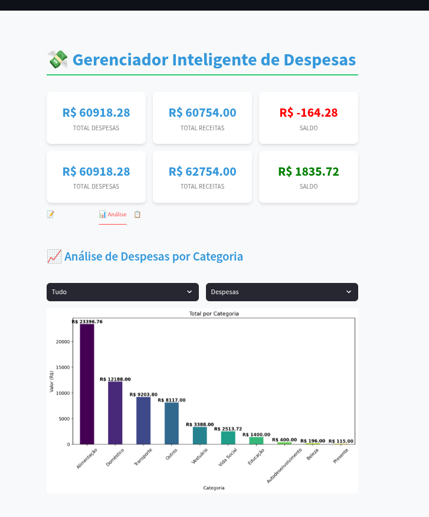

# 💸 Gerenciador Inteligente de Despesas

Um aplicativo moderno para controle de despesas pessoais desenvolvido com Python e Streamlit, focado na facilidade de uso e visualizações claras para acompanhamento financeiro. Foi inspirado nesse tutorial [Free Code Camp](https://www.freecodecamp.org/news/build-smart-expense-tracker-with-python-and-llms/) da [Happiness Omale](https://github.com/codinghappiness-web).



## 📋 Funcionalidades

- **Registro de Despesas e Receitas**: Adicione facilmente suas transações financeiras
- **Categorização**: Organize seus gastos em categorias para melhor controle
- **Visualizações Detalhadas**: Gráficos de barras e pizza para análise de gastos
- **Filtragem por Período**: Analise seus gastos por períodos específicos
- **Métricas em Tempo Real**: Visualize totais de despesas, receitas e saldo atual
- **Interface em Português**: Totalmente adaptado para o português do Brasil
- **Design Responsivo**: Funciona em desktop e dispositivos móveis

## 🚀 Como Executar

### Pré-requisitos

- Python 3.10 ou superior
- pip (gerenciador de pacotes Python)

### Opção 1: Executar Localmente

1. Clone o repositório:
   ```bash
   git clone https://github.com/seu-usuario/gerenciador-despesas.git
   cd gerenciador-despesas
   ```

2. Crie um ambiente virtual:
   ```bash
   python3 -m venv venv
   source venv/bin/activate  # No Windows: venv\Scripts\activate
   ```

3. Instale as dependências:
   ```bash
   pip install -r requirements.txt
   ```

4. Execute o aplicativo:
   ```bash
   streamlit run app.py
   ```

5. Acesse o aplicativo no navegador:
   ```
   http://localhost:8501
   ```

### Opção 2: Executar com Docker

1. Com Docker instalado, execute:
   ```bash
   docker run -d -p 8501:8501 juliomourajr92/gerenciador-despesas:1.0
   ```

2. Acesse o aplicativo no navegador:
   ```
   http://localhost:8501
   ```

### Opção 3: Construir sua própria imagem Docker

1. Clone o repositório:
   ```bash
   git clone https://github.com/seu-usuario/gerenciador-despesas.git
   cd gerenciador-despesas
   ```

2. Construa a imagem Docker:
   ```bash
   docker build -t gerenciador-despesas:1.0 .
   ```

3. Execute o container:
   ```bash
   docker run -d -p 8501:8501 gerenciador-despesas:1.0
   ```

## 📁 Estrutura do Projeto

```
gerenciador-despesas/
├── app.py              # Aplicativo Streamlit principal
├── style.css           # Estilos CSS personalizados
├── despesas_br.csv     # Arquivo de dados (criado automaticamente)
├── requirements.txt    # Dependências do projeto
├── Dockerfile          # Configuração para construir imagem Docker
└── README.md           # Este arquivo
```

## 📦 Dependências Principais

- **Streamlit**: Framework para criar aplicativos web com Python
- **Pandas**: Análise e manipulação de dados
- **Matplotlib**: Visualização de dados
- **NumPy**: Suporte para operações numéricas

## 🛠️ Personalização

### Adicionando Novas Categorias

O aplicativo já vem com categorias básicas, mas você pode adicionar novas categorias simplesmente criando uma transação com uma nova categoria. O sistema automaticamente a incorporará nas listas suspensas para uso futuro.

### Personalização de Estilos

Você pode personalizar a aparência do aplicativo modificando o arquivo `style.css`. O aplicativo aplica automaticamente os estilos quando carregado.

## 🌐 Infraestrutura e CI/CD
Este projeto utiliza Terraform para gerenciar a infraestrutura na nuvem e GitHub Actions para automatizar o processo de Integração e Entrega Contínua (CI/CD), garantindo que a aplicação seja implantada de forma consistente e eficiente a cada nova alteração.

Terraform
A infraestrutura para hospedar a aplicação é descrita em arquivos Terraform. Isso permite que o ambiente seja provisionado e gerenciado de forma declarativa e automatizada, garantindo a consistência e a replicabilidade da infraestrutura. A estrutura de código está organizada em módulos para melhor reuso e manutenção.

GitHub Actions (CI/CD)
O pipeline de CI/CD é configurado no arquivo de workflow do GitHub Actions. Ele é acionado automaticamente a cada push no branch main e executa os seguintes passos:

Construção da Imagem Docker: O pipeline constrói uma nova imagem Docker da aplicação. A imagem é taggeada com o hash do commit para garantir uma versão única e também com a tag latest.

Push para o Docker Hub: As imagens recém-construídas são enviadas para o Docker Hub.

Deploy com Terraform: O Terraform é executado para aplicar as mudanças de infraestrutura. Ele utiliza a nova tag da imagem Docker, garantindo que o serviço seja atualizado com a versão mais recente da aplicação.

Backend Remoto: O estado do Terraform é armazenado em um bucket S3, garantindo que o estado da infraestrutura seja persistente e compartilhado de forma segura entre as execuções do pipeline.

Destruição da Infraestrutura
A remoção da infraestrutura (terraform destroy) é um processo manual. O pipeline de CI/CD foi configurado para que a destruição dos recursos só possa ser acionada através de um comando manual no GitHub Actions, evitando a remoção acidental da infraestrutura em produção.

## 📄 Licença

Este projeto está licenciado sob a Licença MIT - veja o arquivo LICENSE para detalhes.

## 👨‍💻 Autor

Desenvolvido por [Julio Moura](https://github.com/JulioMourajr)

---

⭐️ Se este projeto foi útil para você, considere deixar uma estrela no GitHub! ⭐️

*Nota: Esta aplicação é para fins educacionais e pessoais. Recomendamos não armazenar informações financeiras sensíveis sem implementar medidas adequadas de segurança.*
